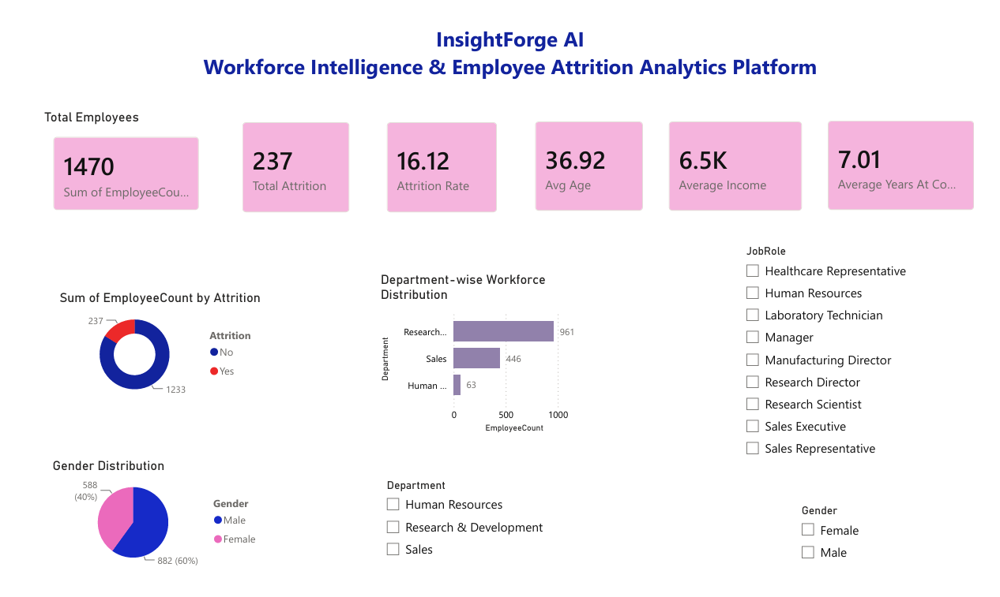
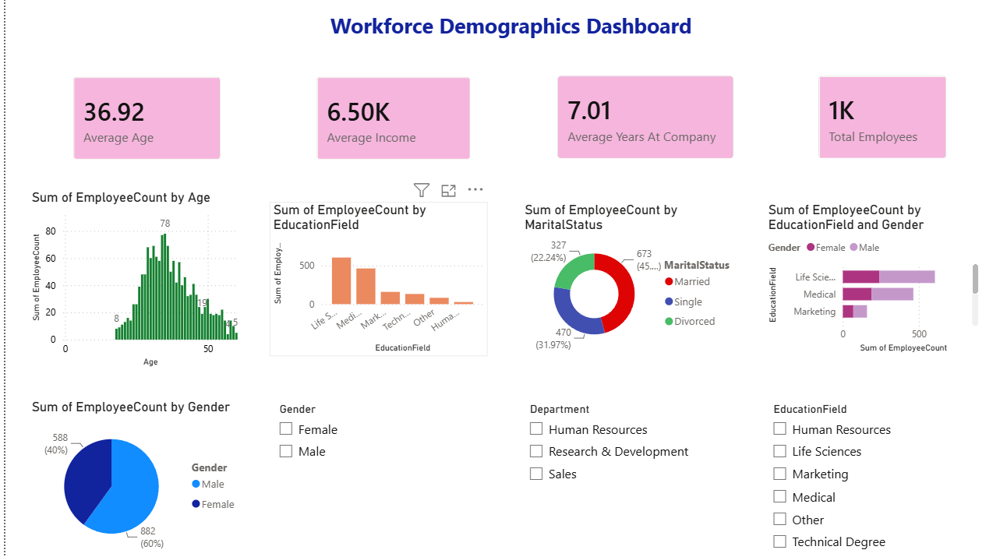
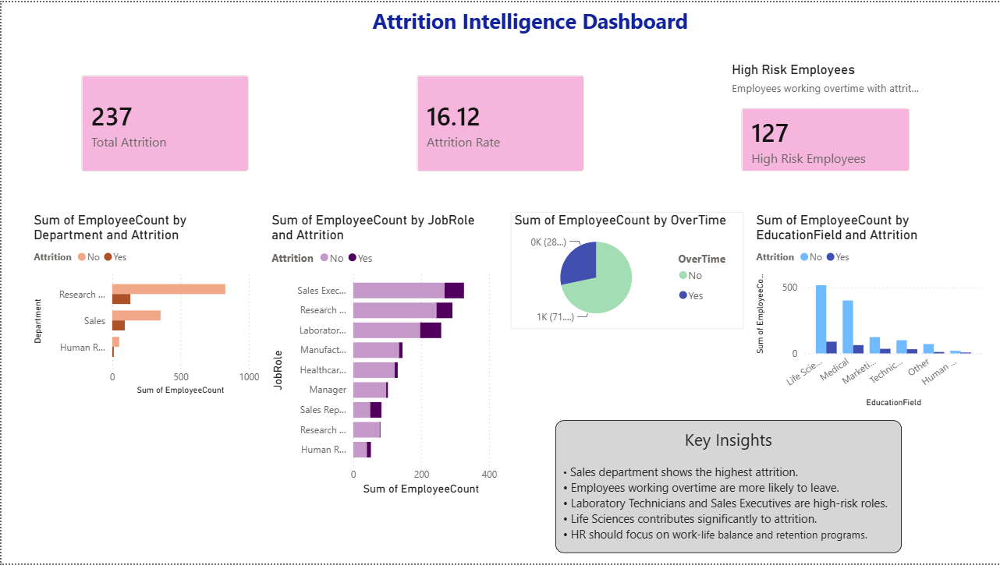
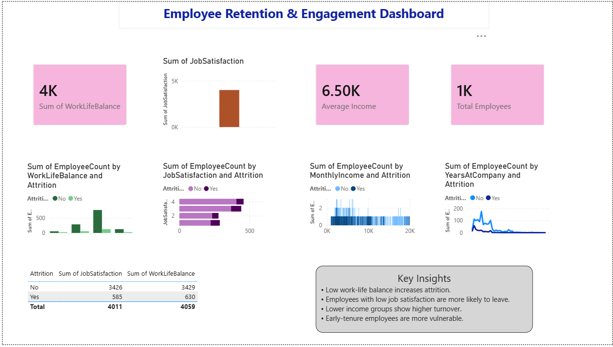
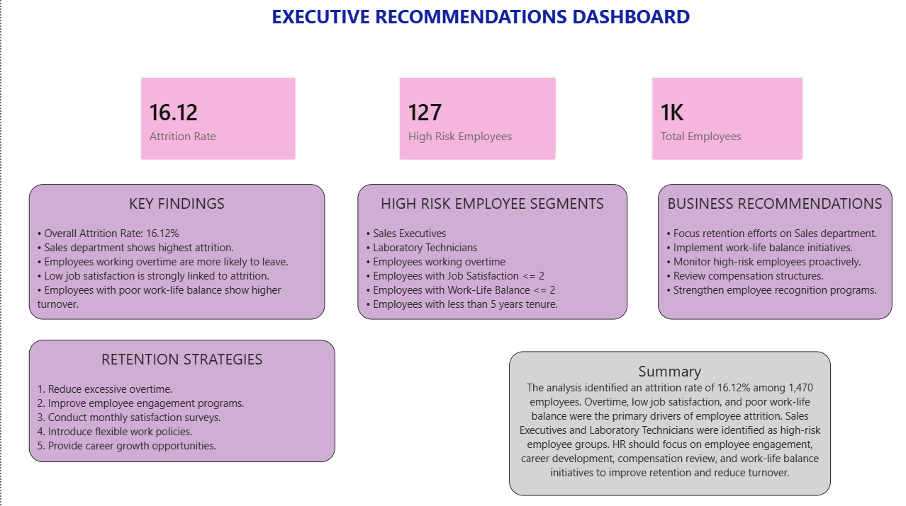

# 🚀 Workforce Intelligence & Employee Attrition Analytics

An end-to-end HR Analytics project that explores employee attrition patterns, workforce demographics, and key factors influencing employee retention using Python (EDA) and Power BI dashboards.

---

# 📊 Project Overview

This project analyzes employee attrition using the IBM HR Analytics dataset. The goal is to understand why employees leave the company and identify actionable insights to improve retention strategies.

The project includes:
- Exploratory Data Analysis (EDA) in Python
- Interactive Power BI Dashboard
- Business insights & recommendations

---

# 📁 Dataset Information

- **Source:** IBM HR Analytics Employee Attrition Dataset  
- **Total Records:** 1470 Employees  
- **Total Features:** 35 Columns  
- **Target Variable:** Attrition (Yes/No)

---

# 🛠️ Tools & Technologies Used

- Python
- Pandas
- Matplotlib
- Jupyter Notebook
- Power BI
- Data Visualization
- Exploratory Data Analysis (EDA)

---

# 📊 Power BI Dashboard Pages

### 1. Executive Overview
- Total Employees
- Attrition Rate
- Average Income
- High-level KPIs

### 2. Workforce Demographics
- Age Distribution
- Gender Distribution
- Department Analysis

### 3. Attrition Intelligence
- Attrition by Department
- Attrition by Job Role
- Key risk factors

### 4. Employee Retention Analysis
- Job Satisfaction impact
- Work-life balance analysis
- Overtime analysis

### 5. Executive Recommendations
- Key findings
- High-risk employee groups
- HR strategies for retention

---

# 📌 Key Insights

- Overall Attrition Rate: **16.12%**
- Average Employee Age: **36.9 years**
- Average Monthly Income: **6502**
- Sales & R&D departments have the highest attrition
- Employees working overtime are more likely to leave
- Job satisfaction and work-life balance strongly impact retention

---

# 📂 Project Structure
InsightForge-AI/
│
├── data/
│ └── WA_Fn-UseC_-HR-Employee-Attrition.csv
│
├── notebooks/
│ └── HR_Analytics_EDA_Final.ipynb
│
├── powerbi/
│ └── HR_Analytics_Dashboard.pbix
│
├── images/
│ ├── page1.png
│ ├── page2.png
│ ├── page3.png
│ ├── page4.png
│ └── page5.png
│
├── reports/
│ └── HR_Analytics_Report.pdf
│
└── README.md

---

# 📸 Dashboard Preview

### Executive Overview

### Workforce Demographics

### Attrition Intelligence

### Employee Retention

### Executive Recommendations

---

# 🧠 Business Impact

This project helps HR teams to:

- Identify employees at risk of leaving
- Improve employee engagement strategies
- Reduce attrition rate
- Optimize workforce planning
- Improve organizational performance

---

# 👨‍💻 Author

**DHARSHINI**

- Data Analytics Project
- Portfolio Project for Internship / Job Ready Skills

---

# ⭐ Conclusion

This project demonstrates a complete data analytics pipeline:
- Data Cleaning
- Exploratory Data Analysis
- Data Visualization
- Business Intelligence Dashboard
- Actionable HR Insights

---

# 🚀 Future Improvements

- Machine Learning model for attrition prediction
- Deployment as web dashboard
- Real-time HR analytics system